<!-- Generated: 2026-05-11 | Files scanned: 70+ | Token estimate: ~900 -->

# Architecture Overview

## System Type

AEM Edge Delivery Services site with a Cloudflare Worker backend, RAG over Cloudflare Vectorize, a swappable multi-vendor LLM, generated pages persisted to Document Authoring (DA), and an admin SPA for sessions, experiments, evaluations, model selection, vector inspection, and user feedback.

## High-Level Data Flow

```
Browser (EDS page)
  │
  ├─ Regular pages → delayed.js → browsing-signals.js → sessionStorage
  │                                                            │
  └─ /?q=... query  ──────────────────────────────────────────┘
        │                                                      │
        ▼                                                      │
  scripts.js (renderArcoRecommenderPage)                       │
        │  reads session context ◄──── session-context.js ◄───┘
        │  NDJSON SSE stream
        ▼
  Cloudflare Worker (arco-recommender)
        ├─ fetch()      → /api/generate, /api/suggest, /api/feedback, /api/admin/*
        ├─ queue()      → arco-eval-queries  (generate / judge / regenerate / rejudge)
        └─ scheduled()  → */5 min cron — eval stuck-run fallback
              │
        Cache lookup: DAClient.exists(/discover/{slug})
              │
              ├─ Hit  → SSE cache-hit event with liveUrl → client redirects
              │
              └─ Miss → Pipeline (flows.js)
                          safety-gate → rate-limit → analyze-behavior →
                          intent-classify → [persona ‖ use-case] →
                          rag-products → [rag-content ‖ rag-features ‖
                          rag-reviews ‖ rag-faqs] → build-prompt → llm-generate
                                          │
                          ┌───────────────┼─────────────────────────────────────┐
                          ▼               ▼                                     ▼
                      Vectorize        LLM provider (Cerebras /          DA (Document Authoring)
                      (arco-content)   Cloudflare AI / SambaNova /       /discover/{slug}
                                       Bedrock — selected via KV)        (createPage → preview → live)
                                          │
                          ◄────── NDJSON blocks + preview/live URLs ──────
        │
        ▼
  Persistence: D1 (run metadata) + KV SESSION_STORE (full payload)
  Optional: user feedback widget → POST /api/feedback → D1 run_feedback
```

## AI Architecture (Mermaid)

```mermaid
flowchart LR
  %% ---------------- Client ----------------
  subgraph CLIENT["① Client — Edge Delivery page"]
    direction TB
    REG["Regular pages<br/>delayed.js → browsing-signals.js"]
    SS["sessionStorage<br/>(intent signals · journey stage)"]
    Q["/?q= query<br/>scripts.js · renderArcoRecommenderPage"]
    REG --> SS
    SS -.session context.-> Q
  end

  %% ---------------- Worker ----------------
  subgraph WORKER["② Cloudflare Worker — arco-recommender"]
    direction TB
    ENTRY["fetch() · queue(arco-eval-queries) · scheduled(*/5 cron)"]
    CACHE_Q{"Cache lookup<br/>DA.exists(/discover/&#123;slug&#125;)"}
    ENTRY --> CACHE_Q

    subgraph PIPE["③ AI Pipeline — flows.js"]
      direction TB
      P1["safety-gate<br/>(reject off-topic / harmful)"]
      P2["rate-limit (per-IP)"]
      P3["analyze-behavior<br/>(summarize browsing signals)"]
      P4["intent-classify<br/>(intent + journey stage)"]
      P5["persona-match ‖ use-case-match"]
      subgraph RAG["RAG — hybrid retrieval (keyword + semantic)"]
        direction TB
        R0["rag-products (maxResults 8)"]
        R1["rag-features ‖ rag-reviews ‖ rag-faqs ‖ rag-content"]
        R0 --> R1
      end
      P6["build-recommender-prompt<br/>(system+user · block guide · brand voice)"]
      P7["llm-generate<br/>(streaming · reasoning toggle · NDJSON EDS blocks)"]
      P1 --> P2 --> P3 --> P4 --> P5 --> RAG --> P6 --> P7
    end

    CACHE_Q -- miss --> PIPE
  end

  %% ---------------- AI Infra ----------------
  subgraph AIINFRA["④ AI Infrastructure & Data"]
    direction TB
    EMB["Workers AI — embeddings<br/>@cf/baai/bge-base-en-v1.5"]
    VEC["Cloudflare Vectorize<br/>arco-content (k-NN semantic RAG)"]
    LLM["LLM Providers (switchable)<br/>Cerebras · Cloudflare AI · SambaNova<br/>Bedrock · Ollama/vLLM (local)"]
    CFG["CACHE KV · llm-config:active<br/>&#123;provider,model,temp,maxTokens,thinking&#125;"]
    DA["DA — Document Authoring<br/>/discover/&#123;slug&#125; · preview → publish"]
    EMB --> VEC
    CFG -.selects.-> LLM
  end

  %% ---------------- Storage ----------------
  subgraph STORE["Persistence"]
    direction TB
    D1["D1 arco-sessions<br/>sessions · runs · experiments · evals · feedback"]
    KV1["KV SESSION_STORE<br/>blocks · debug · RAG payloads"]
    AE["Analytics Engine<br/>arco_usage"]
  end

  %% ---------------- Eval loop ----------------
  subgraph EVAL["Evaluation & Quality loop"]
    direction TB
    JUDGE["LLM Judge — AWS Bedrock (Claude)<br/>7-dimension rubric"]
    ASRT["Deterministic assertions<br/>broken-token · unbalanced-html · gold"]
    EQ["CF Queue arco-eval-queries<br/>generate · judge · regenerate · rejudge"]
    FB["User feedback widget<br/>POST /api/feedback → run_feedback"]
    EQ --> JUDGE
    EQ --> ASRT
    FB -.judge↔user divergence.-> JUDGE
  end

  %% ---------------- Edges ----------------
  Q -- "NDJSON SSE" --> ENTRY
  CACHE_Q -- "hit → liveUrl" --> Q
  RAG <--> VEC
  P4 -.uses.-> LLM
  P7 --> LLM
  P7 -- "blocks" --> DA
  DA -- "preview/live URLs" --> Q
  PIPE --> D1
  PIPE --> KV1
  WORKER --> AE
  FB --> D1

  classDef client fill:#e6f0ff,stroke:#3b6fb5,color:#10243e;
  classDef worker fill:#f1e6da,stroke:#6f4e37,color:#3a2a1c;
  classDef ai fill:#efe6ff,stroke:#7a4ed1,color:#2c1a4d;
  classDef vec fill:#e2f6f4,stroke:#1f9e92,color:#0c3b37;
  classDef store fill:#eef0f2,stroke:#6b7280,color:#222;
  classDef eval fill:#e9f7ec,stroke:#2f9e44,color:#13361d;

  class REG,SS,Q client;
  class ENTRY,CACHE_Q,P1,P2,P3,P4,P5,P6,P7,R0,R1 worker;
  class EMB,LLM,CFG,DA ai;
  class VEC vec;
  class D1,KV1,AE store;
  class JUDGE,ASRT,EQ,FB eval;
```



## Service Boundaries

| Layer | Technology | Purpose |
|-------|-----------|---------|
| Frontend | Vanilla JS + CSS, EDS blocks | Page decoration, signal collection, stream rendering, feedback widget |
| Backend | Cloudflare Worker `arco-recommender` | Recommender pipeline, admin, analytics, eval orchestration |
| Async eval | Cloudflare Queue `arco-eval-queries` | Generate/judge/regenerate/rejudge work, 429 backoff via `delaySeconds` |
| Scheduled | Cloudflare Cron (`*/5 * * * *`) | Eval stuck-run fallback (defense-in-depth for queue delivery) |
| Content store | DA (Document Authoring) | Generated page persistence + preview/publish |
| Vector DB | Cloudflare Vectorize | Semantic RAG over `arco-content` |
| LLM | Cerebras / Cloudflare AI / SambaNova / AWS Bedrock | Page content generation + judge |
| Metadata DB | Cloudflare D1 (`arco-sessions`) | Sessions, runs, experiments, eval runs, feedback |
| Run payloads | Cloudflare KV (`SESSION_STORE`) | Full block + debug + RAG context payloads |
| Cache / config | Cloudflare KV (`CACHE`) | HTTP cache + `llm-config:active` |
| Guides | Cloudflare KV (`GUIDES`) | Static guide content |

## Cache-First Page Serving

Repeat queries skip the full pipeline:
1. Client sends query + session context to `/api/generate`.
2. Worker derives a deterministic slug (keyword extraction + stable hash, no `Date.now()`), checks `DAClient.exists(/discover/{slug})`.
3. Cache hit → SSE `cache-hit` event with `liveUrl` + `previewUrl`; client redirects immediately.
4. Cache miss → pipeline runs, persists to DA at the deterministic path, streams blocks to client.
5. `?regen` bypasses cache and overwrites the existing page.
6. `?preset=foo` opens a separate cache slot under `/discover/foo/{slug}`.

## Session / Page / Run Hierarchy

```
session (sessionStorage per browser tab) — sessionId UUID
  └─ page (?q= URL visit)                — pageId UUID
      └─ run (/api/generate call)        — runId UUID
            └─ feedback (optional)       — UNIQUE(run_id, session_id) in run_feedback
```

`run_index` is `0` for the initial run and `1..N` for each follow-up chip click. `parent_run_id` links a follow-up run back to the run whose chip was clicked.

## Admin Surface

A single EDS-hosted block (`/admin`, source `blocks/admin/admin.js`) is the primary admin UI, gated by HTTP Basic auth against `ADMIN_TOKEN`. See `docs/ADMIN.md` for the complete view map and route list. Major views:

- **Sessions / Pages / Runs** — browse history of every `/api/generate` call with full debug payloads.
- **Experiments** — multi-model A/B for one query; parallel variants share the upstream RAG pipeline.
- **LLM Evaluations** — matrix of query suite × models with Claude (Bedrock) judge; async via CF Queue; deterministic assertions + blocker badges + 95% CIs.
- **Model Settings** — pick active `{provider, model, temperature, maxTokens}` (persisted in CACHE KV).
- **Vectorize** — k-NN search + index stats over `arco-content`.
- **Feedback** — list / per-run detail / CSV+JSON export; eval matrix chips cross-link to user feedback per query.
