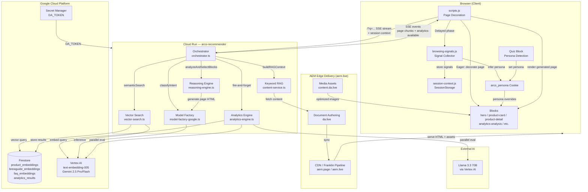
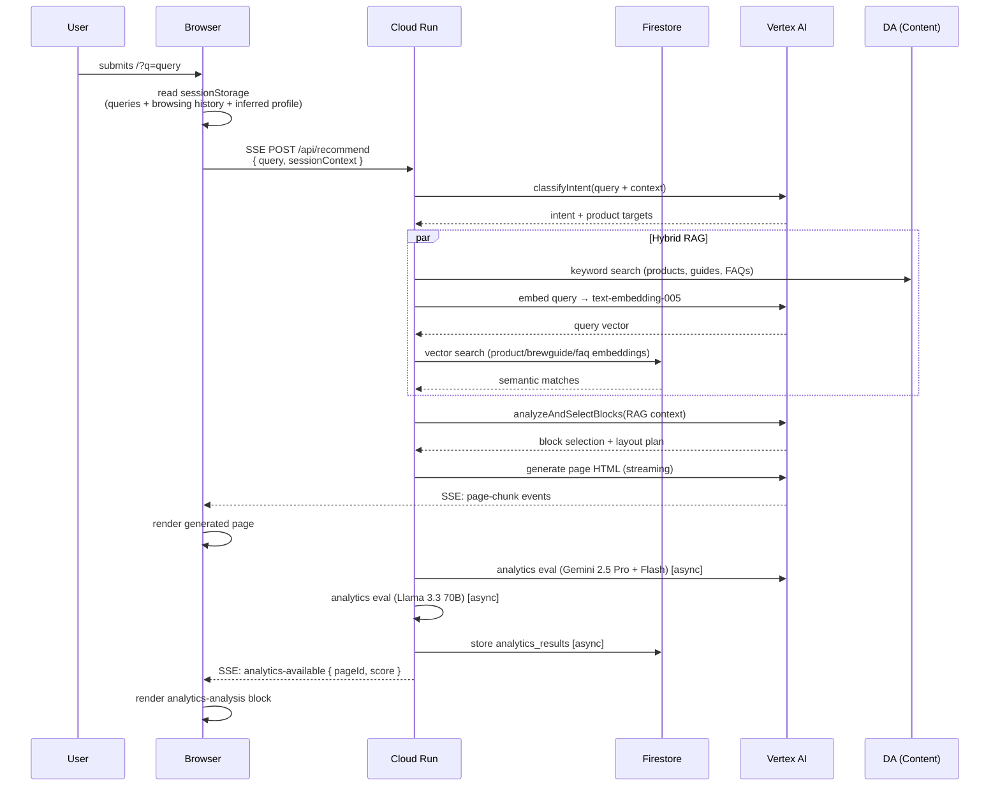

# Arco Architecture Diagram

## System Overview

## Data Flow: Recommender Query

## Key Components

| Layer | Component | Role |
|---|---|---|
| Client | `scripts/scripts.js` | Page decoration entry point; streams recommender queries |
| Client | `scripts/browsing-signals.js` | Passive signal collector + rule-based intent classifier |
| Client | `scripts/session-context.js` | SessionStorage manager — queries, browsing history, inferred profile |
| Client | `blocks/hero/` | Persona-aware hero with cookie-based content swap |
| Client | `blocks/product-detail/` | PDP block with gallery, specs, JSON-LD schema |
| Client | `blocks/analytics-analysis/` | Score ring + dimension bars from multi-agent eval |
| Client | `personalization/assembly-engine.js` | Runtime page composition from persona signal |
| Server | `orchestrator.ts` | Main pipeline — intent → RAG → reasoning → generation → analytics |
| Server | `reasoning-engine.ts` | Block selection and layout planning via Gemini |
| Server | `content-service.ts` | Keyword RAG + semantic search merge |
| Server | `vector-search.ts` | Firestore native vector search + Vertex AI embeddings |
| Server | `analytics-engine.ts` | Multi-model quality evaluation (3-model consensus) |
| Infra | Firestore | Vector collections + analytics results storage |
| Infra | Vertex AI | Gemini 2.5 Pro/Flash inference + text-embedding-005 |
| CMS | DA (da.live) | Content authoring and source of truth for all pages |
| CDN | AEM Edge Delivery | Content delivery via aem.page / aem.live |
